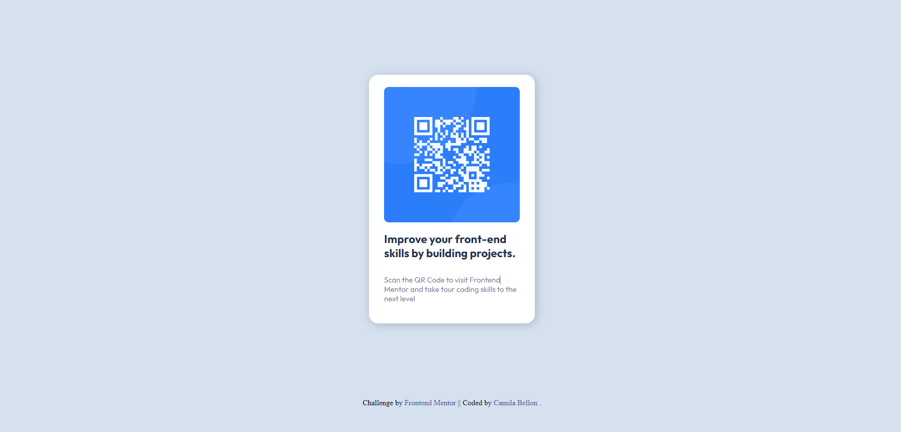

# Frontend Mentor - QR code component solution

This is a solution to the [QR code component challenge on Frontend Mentor](https://www.frontendmentor.io/challenges/qr-code-component-iux_sIO_H).
Frontend Mentor challenges help you improve your coding skills by building realistic projects. 

## Table of contents

- [Overview](#overview)
  - [Screenshot](#screenshot)
- [My process](#my-process)
  - [Built with](#built-with)
- [Author](#author)

## Overview

### Screenshot

 Desktop 
 Mobile

## My process

### Built with

- Semantic HTML5 markup
- CSS custom properties
- Flexbox

## Author

- Github - [miahcastro](https://github.com/miahcastro)
- Frontend Mentor - [@miahcastro](https://www.frontendmentor.io/profile/miahcastro)
- Twitter - [@miabellon](https://www.twitter.com/miabellon)
- LinkedIn - [camilabellon](https://www.linkedin.com/in/camila-mayara-castro-bellon/)

